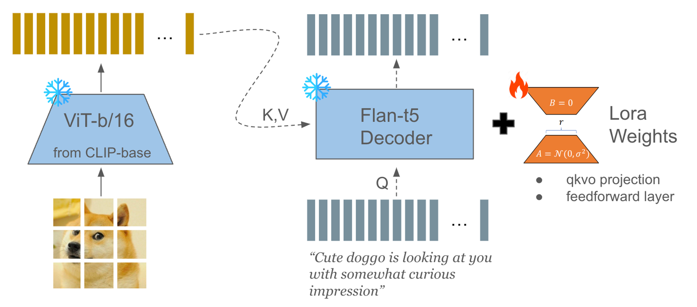

# GCC-caption-lora
This repo contains codes to train an image captioning model using GCC dataset. You can download, process, train lora weights injected to LM decoder and evaluate the results.

## Dataset Statistics

The training set includes 162,853 images, with the initial 300,000 samples being targeted for download, and the validation set contains 11,273 images, with attempts made to download the entire valid set. 

### Captions: Sequence Length Distribution w.r.t. T5 Tokens

- **Train**: Mean = 12.97, Median = 12.0, Std. = 6.23
- **Valid**: Mean = 13.06, Median = 12.0, Std. = 6.20

## Model Architecture
Captioner model is composed of CLIP image encoder and Flan-T5 decoder. Each input image is injected via cross-attention to the decoder, after a linear projection to fit the size of embedding. decoder's qkvo projection and feed forword layer can be augmented with lora weights.



## Training Details

- **Image Encoder**: Utilizes CLIP image encoder.
- **Text Decoder**: Employs Flan-T5-base/large models.
- **LoRA Application**: Applied to attention projection layers (attn) or both attention projection and feed-forward layers (attn,ffn).
- **LoRA Configuration**: Rank 8, α=8, with a dropout rate of 0.1. The scaling factor is calculated using α/sqrt(r). (see [rslora paper](https://arxiv.org/abs/2312.03732))
- **Training Parameters**: Learning rate of 4e-5, batch size of 128, linear learning rate schedule with a 0.2 warmup phase, AdamW optimizer, and bfloat16 training.
- **Hardware**: Each model is trained on a single A6000 GPU for optimized performance.
- You can check out [its wandb training log](https://wandb.ai/lucas01/GCC-caption?workspace=user-lucas01).

## Evaluation & Analysis

The evaluation of the model's performance was conducted using CIDEr, BLEU@4, and CLIP-large cosine similarity. Below are the results segmented by decoder size, LoRA targets, and sampling methods.

### By Decoder Size and LoRA Targets

- **CIDEr, BLEU@4, CLIP Score**
  
  | Configuration      | CIDEr   | BLEU@4 | CLIP Score |
  |--------------------|---------|--------|------------|
  | large-attn         | 0.3506  | 0.0281 | 0.2128     |
  | large-attn, ffn    | 0.4083  | 0.0352 | 0.2132     |
  | base-attn          | 0.3815  | 0.0329 | 0.2120     |
  | base-attn, ffn     | 0.4336  | 0.0384 | 0.2160     |
  | Ground Truth (GT)  | n/a     | n/a    | 0.2456     |

### Best-of-N Sampling (N=10)

- **CIDEr, BLEU@4, CLIP Score**
  
  | Configuration      | CIDEr   | BLEU@4 | CLIP Score |
  |--------------------|---------|--------|------------|
  | large-attn         | 0.3822  | 0.0238 | 0.2489     |
  | large-attn, ffn    | 0.4217  | 0.0293 | 0.2512     |
  | base-attn          | 0.4005  | 0.0272 | 0.2489     |
  | base-attn, ffn     | 0.4519  | 0.0334 | 0.2525     |

### By Decoding Methods

- **Sampling Method: Top-p=0.9, Temperature=0.5, Repetition Penalty=1.2**
  
  | Configuration                | CIDEr   | BLEU@4 | CLIP Score |
  |------------------------------|---------|--------|------------|
  | large-attn, ffn-sample       | 0.3575  | 0.0259 | 0.2143     |
  | large-attn, ffn-beam         | 0.4083  | 0.0352 | 0.2132     |
  | base-attn, ffn-sample        | 0.3734  | 0.0270 | 0.2141     |
  | base-attn, ffn-beam          | 0.4336  | 0.0384 | 0.2160     |
  | Ground Truth (GT)            | n/a     | n/a    | 0.2456     |

### Analysis

- The base-attn, ffn configuration under the Best-of-N Sampling strategy achieved the highest CIDEr and BLEU@4 scores.
- Using Best-of-N sampling improves CIDEr scores as well across all sizes and lora targets, while somehow compromising syntactic BLEU@4 score.
- base decoder benefits the most with given hyperparameter settings. (maybe larger model needs more batch)

## Generated Samples


| Model Configuration                        | Image 1 Caption                                     | Image 2 Caption                          | Image 3 Caption                        | Image 4 Caption                         | Image 5 Caption                                       |
|--------------------------------------------|-----------------------------------------------------|-----------------------------------------|---------------------------------------|----------------------------------------|-------------------------------------------------------|
| large-attn, ffn (beam)                     | "a group of people gathered for a photo."           | "close up of a little boy's hair."      | "a woman with a cat on a street"      | "a man stands in a pond of water."      | "a balloon flies in the air"                   |
| large-attn, ffn (best-of-N sampling)       | "the crowds of the armed soldiers, who were brought by the police." | "a little boy is getting ready for a haircut" | "a woman is seen on the street of a cat" | "a man in a flower stands by a lake" | "a balloon is swayed by a blue sky" |
| base-attn, ffn (beam)                      | "military commander, a member of the armed force, poses for a photo"               | "hairstyles for a child's face."            | "a woman carries a cat on a street in a city" | "portrait of a young man in a pond at sunset." | "a colorful balloon floats in the air"                |
| base-attn, ffn (best-of-N sampling)        | "a parade of soldiers in the streets"           | "a child is given a haircut" | "a woman in a white hat carries a cat on a street" | "a man in a flower garden with a lot of water" | "a colorful balloon flying in the air" |
| Ground Truth (GT)                          | "soldiers walk down the street of a city"           | "a little boy is trimmed in the hairdresser 's" | "a pet cat rides through the streets on the head of her female owner." | "person grow lotus in the season" | "a colorful hot-air balloon being inflated in the distance" |

## Files

- ```lora.py``` : minimal interface to inject lora weights to FLAN-T5 decoder.
- ```modeling_t5.py``` : modified from huggingface's ```modeling_t5.py``` to function with ```lora.py```
- ```train.py``` : training script
- ```evaluation.py``` : captioning inference script
- ```model.py``` : definition of Captioner model.
- ```preprocess_data.py``` : downloading images for dataset
- ```best_of_n_sample.py``` : captioning inference script using best-of-n sampling strategy.
- ```custom_trainer.py``` : huggingface trainer that supports ar-generation during training
- ```clipscore.py``` : clipscore computation
- ```nlg-eval``` : see [nlg-eval's documentation](https://github.com/Maluuba/nlg-eval). used for BLEU and CIDEr computation. 
- ```tests``` : tests to make sure model is working
- ```scripts``` : shell scripts to run python scripts